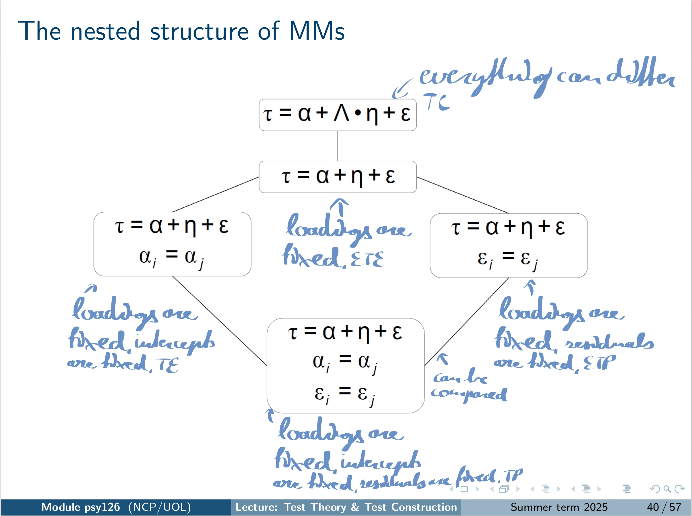

---
jupytext:
  formats: md:myst
  text_representation:
    extension: .md
    format_name: myst
    format_version: 0.13
    jupytext_version: 1.11.5
kernelspec:
  display_name: Python 3
  language: python
  name: python3
---

# <i class="fa-solid fa-chart-line"></i> Quantitative

## Measurement Models for Quantitative Scores

Welcome to today's seminar on measurement models applied to quantitative datasets.

Today we extend our model selection to models appropriate for dealing with quantitative datasets. Here, items are coded with not necessary natural numeric values (e.g. 4.5, 4.6, 4.87).

The models we will introduce today can be organised in three families according to increasing restrictiveness:

- **Tau-Congeneric Measurement Models** - freely estimates item difficulty & -discrimination parameters and item reliability.
- **(Essentially) Tau-Equivalent Measurement Models** - additionally restricts the item discrimination parameter (Essentially Tau-Equivalent) and also the item difficulty parameter (Tau-Equivalent).
- **(Essentially) Tau-Parallel Measurement Models** - additionally restricts the item discrimination parameter & reliability (Essentially Tau-Parallel) and also the item difficulty parameter (Tau-Parallel).

### Reminder:
In the lecture we used this slide to get an overview of the different measurement models and their assumptions. Maybe you remember?

